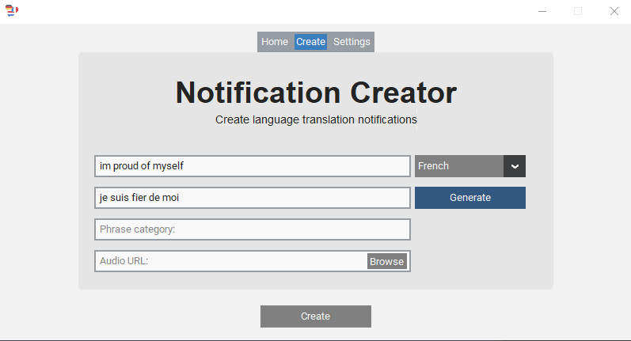
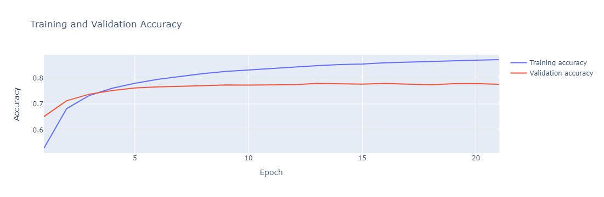

# Fluency - Language Learning Desktop Application

- A desktop notification app that uses a Seq2Seq model to allow users to create various language notifications.
---

# Transforming English to French Language Translation

## Data Preparation

In this section, we will prepare our dataset for training by performing
the following tasks:

- Clean the text data by removing punctuation symbols, numbers, and
  converting characters to lowercase.
- Replace Unicode characters with their ASCII equivalents.
- Determine the maximum sequence length of both English and French
  phrases to establish input and output sequence lengths for our model.

#### Handling language data formatting

<table class="dataframe" data-border="1">
<thead>
<tr class="header" style="text-align: right;">
<th></th>
<th>english_text</th>
<th>french_text</th>
</tr>
</thead>
<tbody>
<tr class="odd">
<th>0</th>
<td>youre very clever</td>
<td>[start] vous etes fort ingenieuse [end]</td>
</tr>
<tr class="even">
<th>1</th>
<td>are there kids</td>
<td>[start] y atil des enfants [end]</td>
</tr>
<tr class="odd">
<th>2</th>
<td>come in</td>
<td>[start] entrez [end]</td>
</tr>
<tr class="even">
<th>3</th>
<td>wheres boston</td>
<td>[start] ou est boston [end]</td>
</tr>
<tr class="odd">
<th>4</th>
<td>you see what i mean</td>
<td>[start] vous voyez ce que je veux dire [end]</td>
</tr>
</tbody>
</table>

## Language Tokenization

⚒️ We will tokenize the English and French phrases using separate
Tokenizer instances and generate padded sequences for model training.
The steps involved are as follows:

1.  Fit a Tokenizer to the English phrases and another Tokenizer to
    their French equivalents.
2.  Compute the vocabulary sizes based on the Tokenizer instances.
3.  Create padded sequences for all phrases.
4.  Prepare features and labels for training:

- The features consist of the padded English sequences and the padded
  French sequences excluding the `[end]` tokens.
- The labels consist of the padded French sequences excluding the
  `[start]` tokens.

## Model Training and Evaluation

We train 🚂 the model and evaluate its performance on the validation
set. Below are the current learning assessment metrics.

#### Evaluate the model's performance

    1563/1563 [==============================] - 14s 9ms/step - loss: 0.2290 - accuracy: 0.8512
    Test Loss: 0.22895030677318573
    Validation Accuracy: 0.8511516451835632

#### Assess the model's learning accuracy

## Translation Testing

Handle the translation process based on the model's predictions.

    English: let us out of here => French: laissenous sortir dici
    English: it could be fun => French: ca pourrait etre marrant
    English: this is my new video => French: cest ma nouvelle video
    English: do you like fish => French: aimestu le poisson
    English: you were in a coma => French: vous etiez dans le coma
    English: dont be upset => French: ne soyez pas fache
    English: didnt you know that => French: le saviezvous
    English: im not exactly sure => French: je nen suis pas a la tete
    English: i put it on your desk => French: je lai mise sur votre bureau
    English: somehow tom knew => French: pourtant tom savait

## Translation Comparison

Compare against Baseline model is:
<a href="https://github.com/LibreTranslate/LibreTranslate"
target="_blank">LibreTranslate</a> which uses a NMT Model architecture

    English: let us out of here => French: laissez-nous sortir d'ici
    English: it could be fun => French: ça pourrait être amusant
    English: this is my new video => French: c'est ma nouvelle vidéo
    English: do you like fish => French: vous aimez le poisson
    English: you were in a coma => French: tu étais dans le coma
    English: dont be upset => French: ne soyez pas contrarié
    English: didnt you know that => French: tu ne savais pas que
    English: im not exactly sure => French: im pas exactement sûr
    English: i put it on your desk => French: je l'ai mis sur ton bureau
    English: somehow tom knew => French: tom le savait

     

